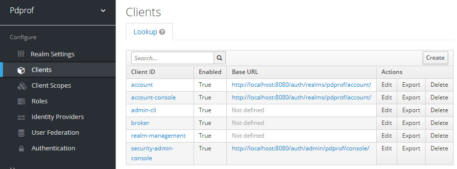
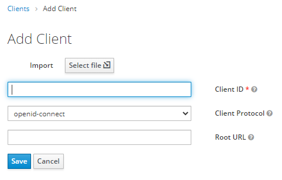

# SAML AUTH Application

## Requirements

- [Docker](https://www.docker.com/)

## Test on Docker

### Build docker image

```
./setup-docker.sh
```

After setup, plesae accesss to 

http://localhost:8080/auth/admin/master/console/#/realms/pdprof/clients

UserId is admin. Password is password

and Create new client with importing spMetadta.xml file generated by setup-docker.sh

Here are screen shots






### Start docker 
```
mkdir -p ~/pdprof/share
docker run --rm -p 9080:9080 -p 9443:9443 -v ~/pdprof:/pdprof:z saml
```

Now you can access https://localhost:9443/security.auth/

UserId is pdprof. Password is password


## Test on OpenShift

After you setup CRC described at [icp4a-helloworld](https://github.com/pdprof/icp4a-helloworld)

You can use following script. 
```
setup-openshift.sh
```

Now you can access to http://db-connections-route-default.apps-crc.testing/security.auth/

Other test is same with docker.
